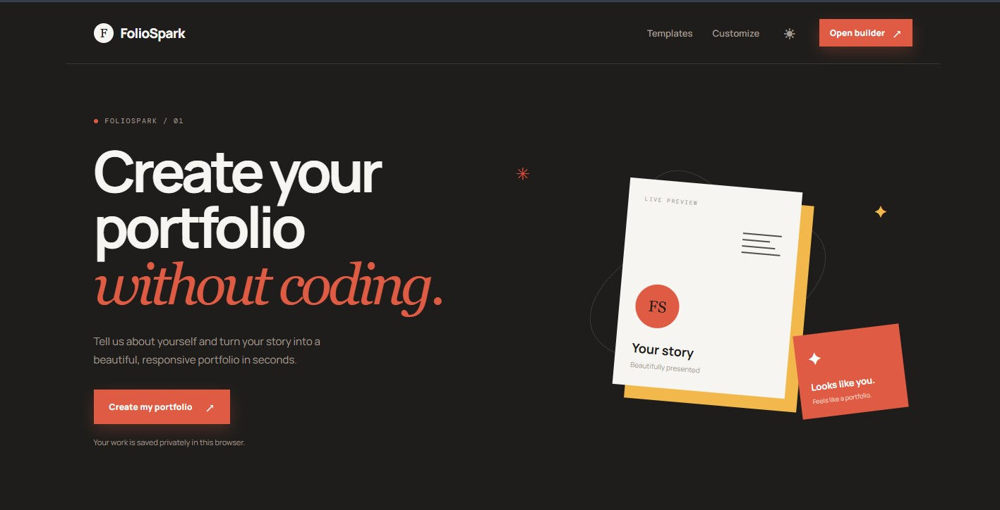
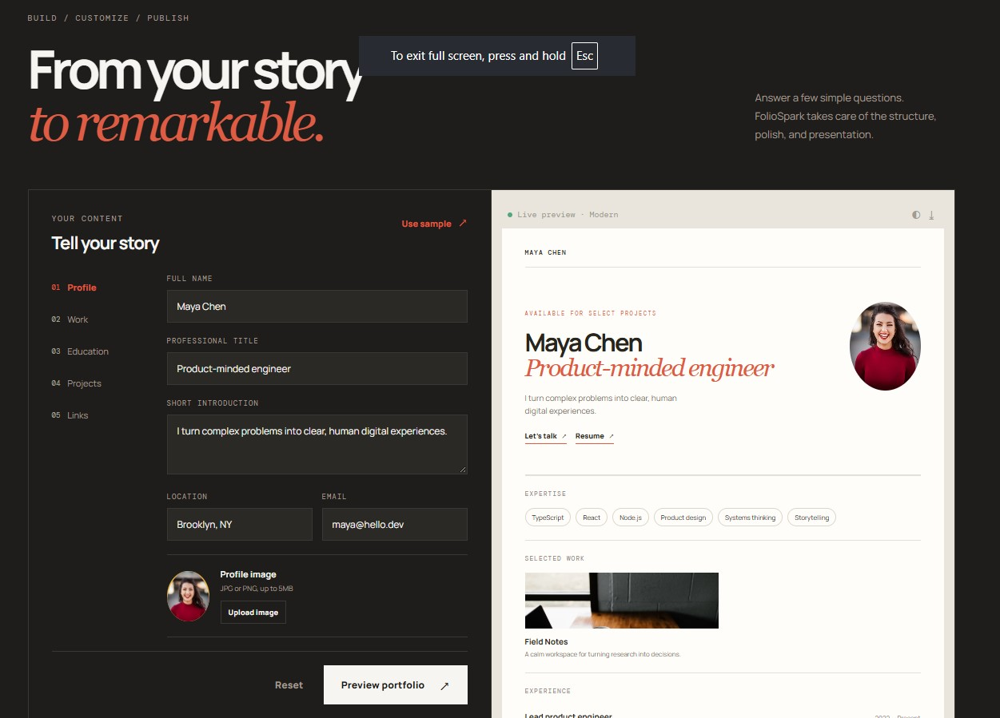
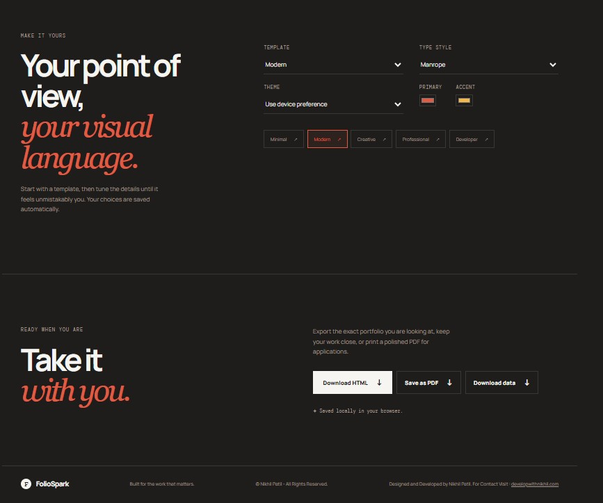
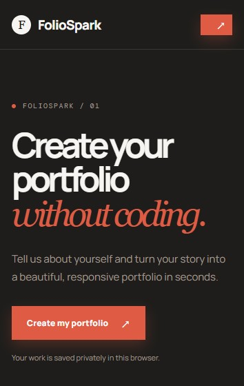
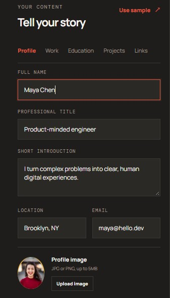
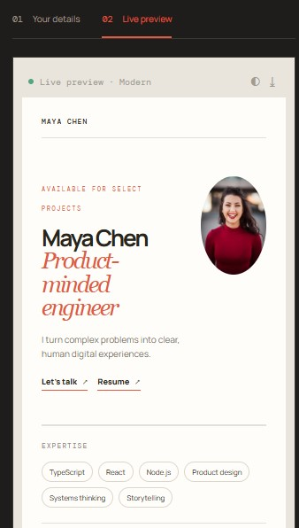
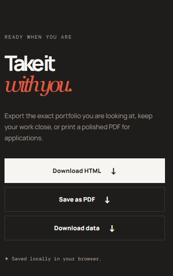

# ✨ FolioSpark — Portfolio Generator

> **Create a professional portfolio without writing a single line of code.**

FolioSpark is a modern, responsive portfolio builder built with **React, TypeScript, and Vite**. It lets you enter your personal information, skills, experience, education, projects, and social links, then instantly turn them into a polished portfolio with a live preview.

Customize the design, switch between templates, upload images, and export your finished portfolio for use anywhere.

---

## 🌐 Live Demo

🚀 **[View Live Demo](#)**

> portfolio-generator.developwithnikhil.com

---

## 📸 Preview

**### Desktop View**







**### Mobile/Responsive View**









---

## ✨ Features

* 📝 **Easy Portfolio Builder**

  * Add your profile, professional title, bio, location, and email
  * Add skills, experience, education, and projects
  * Add social media and resume links
  * Add achievements and other professional information

* 👀 **Live Portfolio Preview**

  * See your portfolio update as you edit your information
  * Preview your portfolio directly inside the builder

* 🎨 **Multiple Templates**

  * Minimal
  * Modern
  * Creative
  * Professional
  * Developer

* 🖌️ **Customization**

  * Choose primary and accent colors
  * Switch between different typography styles
  * Choose light, dark, or system theme
  * Customize the overall visual appearance of your portfolio

* 🖼️ **Image Uploads**

  * Upload a profile image
  * Add images to individual projects
  * Supports JPG, PNG, and WebP images

* 💾 **Local Data Storage**

  * Portfolio data is automatically saved in your browser
  * No account or backend database required
  * Your portfolio information stays locally in your browser

* 📤 **Export Options**

  * Download your portfolio as a standalone HTML file
  * Save your portfolio as a PDF using the browser print dialog
  * Download your portfolio data as JSON

* 📱 **Responsive Design**

  * Designed for desktop and mobile experiences
  * Responsive portfolio preview and builder interface

---

## 🛠️ Built With

### Frontend

* **React**
* **TypeScript**
* **Vite**
* **CSS**
* **HTML5**

### Development Tools

* **Oxlint**
* **TypeScript**
* **Vite**

---

## 📂 Project Structure

```text
portfolio-generator/
│
├── public/
│
├── src/
│   ├── App.tsx
│   ├── App.css
│   ├── enhancements.css
│   ├── index.css
│   └── main.tsx
│
├── .gitignore
├── index.html
├── package.json
├── package-lock.json
├── tsconfig.json
├── tsconfig.app.json
├── tsconfig.node.json
├── vite.config.ts
└── README.md
```

---

## 🚀 Getting Started

Follow these steps to run FolioSpark locally.

### Prerequisites

Make sure you have installed:

* [Node.js](https://nodejs.org/)
* npm

You can check your installed versions with:

```bash
node -v
npm -v
```

### Installation

Clone the repository:

```bash
git clone https://github.com/nikhil3311/portfolio-generator.git
```

Navigate into the project:

```bash
cd portfolio-generator
```

Install dependencies:

```bash
npm install
```

Start the development server:

```bash
npm run dev
```

Open the local development URL shown in your terminal.

---

## 📜 Available Scripts

### Start Development Server

```bash
npm run dev
```

Runs the application in development mode using Vite.

### Build for Production

```bash
npm run build
```

Creates an optimized production build.

### Preview Production Build

```bash
npm run preview
```

Serves the production build locally for testing.

### Lint the Project

```bash
npm run lint
```

Runs Oxlint to check the project for code-quality issues.

---

## 🧩 How It Works

FolioSpark follows a simple workflow:

```text
Enter Your Information
        ↓
Customize Your Portfolio
        ↓
Choose a Template
        ↓
Preview Changes Live
        ↓
Export Your Portfolio
```

### 1. Add Your Information

Enter your:

* Personal information
* Professional title
* Short introduction
* Skills
* Work experience
* Education
* Projects
* Resume
* Social links
* Achievements

### 2. Customize Your Design

Choose from multiple portfolio templates and customize:

* Theme
* Primary color
* Accent color
* Typography

### 3. Preview

Use the live preview to see how your portfolio looks before exporting it.

### 4. Export

Take your portfolio with you by exporting:

* HTML
* PDF
* JSON portfolio data

---

## 💾 Data & Privacy

FolioSpark stores your portfolio information using **browser local storage**.

Your portfolio data is saved locally under the browser's storage rather than being sent to a backend database.

This means you can build and edit your portfolio without creating an account.

> **Note:** Clearing your browser's local storage can remove your saved portfolio data. Export your JSON data if you want a backup.

---

## 🎨 Available Templates

FolioSpark currently includes:

| Template         | Description                        |
| ---------------- | ---------------------------------- |
| **Minimal**      | Clean and focused presentation     |
| **Modern**       | Contemporary portfolio layout      |
| **Creative**     | Expressive visual presentation     |
| **Professional** | Traditional professional portfolio |
| **Developer**    | Developer-focused presentation     |

---

## 📦 Export Your Portfolio

### HTML

Download a standalone HTML version of your portfolio that can be hosted independently.

```text
your-name.html
```

### PDF

Use the browser's print functionality to save your portfolio as a PDF.

### JSON

Download your portfolio information as structured JSON:

```text
portfolio-data.json
```

This can also be useful as a backup of your portfolio content.

---

## 🖼️ Supported Images

FolioSpark supports:

* JPG
* JPEG
* PNG
* WebP

You can use images for:

* Profile pictures
* Project previews

---

## 🔮 Future Improvements

Some ideas for future versions include:

* [ ] More portfolio templates
* [ ] Drag-and-drop section ordering
* [ ] Custom portfolio sections
* [ ] More typography options
* [ ] Portfolio sharing
* [ ] Cloud-based portfolio storage
* [ ] Custom domains
* [ ] Additional export formats
* [ ] Improved accessibility
* [ ] More advanced project layouts

---

## 🤝 Contributing

Contributions are welcome!

If you have an idea for a new feature or improvement:

1. Fork the repository
2. Create a new branch

```bash
git checkout -b feature/your-feature
```

3. Make your changes
4. Commit your changes

```bash
git commit -m "Add your feature"
```

5. Push your branch

```bash
git push origin feature/your-feature
```

6. Open a Pull Request

---

## 📄 License

Copyright © 2026 **Nikhil Patil**

FolioSpark is licensed under the **MIT License**.

You are free to use, copy, modify, merge, publish, distribute, sublicense, and/or sell copies of the software, subject to the terms of the MIT License.

See the [`LICENSE`](https://github.com/nikhil3311/weather-dashboard/blob/main/LICENSE) file for the complete license text.

---

## 👨‍💻 Developer

**FolioSpark is designed and Developed by Nikhil Patil.**

* 🌐 Portfolio: [developwithnikhil.com](https://developwithnikhil.com)
* 💻 GitHub: [@nikhil3311](https://github.com/nikhil3311)

---

## ⭐ Support

If you find FolioSpark useful, consider giving the repository a ⭐ on GitHub.

It helps support the project and encourages further development!

---

### Built with ❤️ by Nikhil Patil
